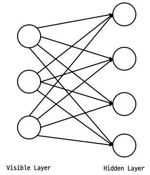
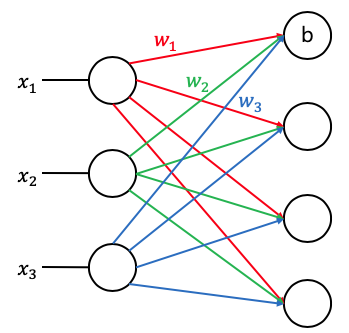
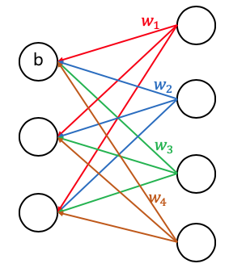

## Weight 초기화 잘해보자

### Vanishing gradient를 해결하는 방법
1. ReLU
2. 초기 **Weight**값 설정

랜덤으로 **Weight**값 설정시 같은 코드를 실행시켜도 
**Cost**값이 변하는 것을 확인할 수 있다.

 

### 모든 **Weight**값을 0으로 초기화해서 사용할 경우
**Chain rule**을 사용할 때 **Weight**값이 사용된다. 
**Weight**값이 0이게 되면 뒤의 모든 값이 0이되어서 
**Vanishing gradient**가 생긴다.

 

### 어떻게 초기 Weight값을 설정할 것인가?
- 무조건 **0**으로 설정하면 안된다.
- "A Fast Learning Algorithm for Deep Belief Nets" 
논문에서 **R**estricted **B**oatman **M**achine(**RBM**) 사용

 

### Restricted Boatman Machine (RBM)
RBM의 구조 
Reestriction : Layer안에서 연결이 없다. 

2가지 Operation을 갖는다. 
- Forward

 
위의 그림과 같은 방법으로 값을 구하는 방법

- Backward

 

입력받은 $$X$$의 값과 **Forward**로 생성된 $$X$$의 값의 
**차가 최저**가 되도록 **Weight**를 조절하는 방법이다.

**KL DIVERGENCE**은 거리를 구할때 사용하는 연산자다. 
**Encoder**/**Decoder**라고도 한다.

 

### 어떻게 RBM이 작동하는가?
