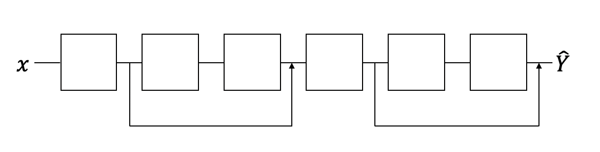
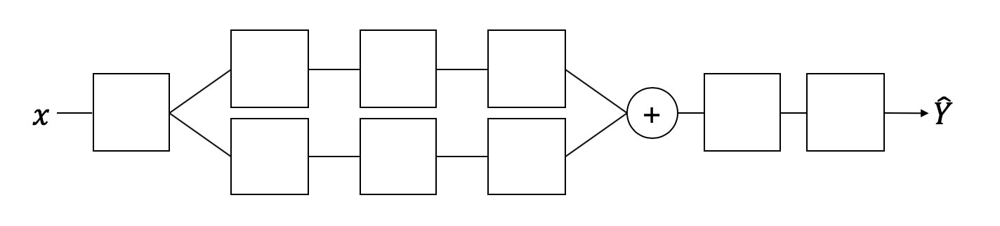
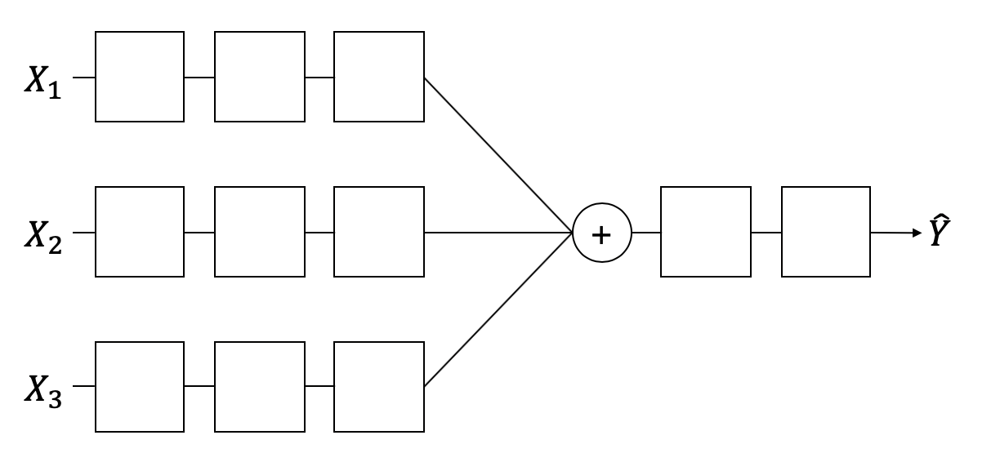
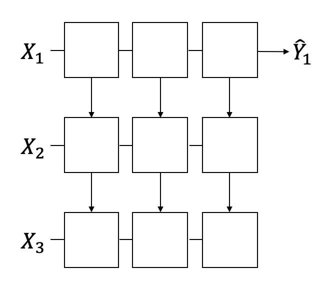

## 레고처럼 넷트웍 모듈을 마음껏 쌓아 보자

### Feedforward neural network
지금까지 사용한 신경망 구조 
몇단을 쌓을것인지는 선택하면된다.

 

### Fast forward
 
2015년에 He가 ImageNet에 제출한 모델 
**3%이하**의 Error를 보인다.

 

### Split & Merge
 
입력이 1개일 경우 여러개의 출력으로 **나누어** 학습을 
진행하다가 하나로 다시 **병합**하면서 예측할수도 있다. 

 
입력이 여러개일 경우 각각의 입력을 처리하고 
하나로 **병합**하는 과정으 학습을 진행할수 있다. 
하나의 **Convolutional Neural Network(CNN)** 형태다.

 

### Recurrent network
 
앞으로만 나가지 않고 옆으로 나가게 Network를 구성 
이것을 **Recurrent Neural Network(RNN**)의 구성이다.
