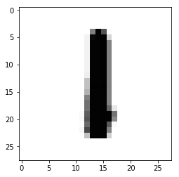

## 가중치 초기화로 MNIST 정확도 높이기

### 사용할 모듈 추가


```python
import tensorflow as tf
import matplotlib.pyplot as plt
import random
```


### MNIST데이터 불러오기


```python
from tensorflow.examples.tutorials.mnist import input_data

mnist = input_data.read_data_sets("MNIST_data/", one_hot=True)
```


### 상수 정의


```python
learning_rate = 0.001
training_epochs = 15
batch_size = 100
```

### 입력값 placeholder 선언


```python
X = tf.placeholder(tf.float32, [None, 784])
Y = tf.placeholder(tf.float32, [None, 10])
```

### Neural Network 구성
**Xavier Initialization**사용<br/>
**Weight**을 저장할 변수를 선언할 때 `initializer`속성에<br/>
`tf.contrib.layers.xavier_initializer()`를 적용하면 된다.


```python
W1 = tf.get_variable("W1", shape=[784, 256],
                    initializer=tf.contrib.layers.xavier_initializer())
b1 = tf.Variable(tf.random_normal([256]))
L1 = tf.nn.relu(tf.matmul(X, W1) + b1)

W2 = tf.get_variable("W2", shape=[256, 256],
                    initializer=tf.contrib.layers.xavier_initializer())
b2 = tf.Variable(tf.random_normal([256]))
L2 = tf.nn.relu(tf.matmul(L1, W2) + b2)

W3 = tf.get_variable("W3", shape=[256, 10],
                    initializer=tf.contrib.layers.xavier_initializer())
b3 = tf.Variable(tf.random_normal([10]))
hypothesis = tf.matmul(L2, W3) + b3
```

### 손실함수와 최적화 방법 정의


```python
cost = tf.reduce_mean(
    tf.nn.softmax_cross_entropy_with_logits_v2(logits=hypothesis, labels=Y)
)
optimizer = tf.train.AdamOptimizer(learning_rate=learning_rate).minimize(cost)
```

### Session 초기화


```python
sess = tf.Session()
sess.run(tf.global_variables_initializer())
```

### 모델 학습 진행


```python
for epoch in range(training_epochs):
    avg_cost = 0
    total_batch = int(mnist.train.num_examples / batch_size)

    for i in range(total_batch):
        batch_xs, batch_ys = mnist.train.next_batch(batch_size)
        feed_dict = {X: batch_xs, Y: batch_ys}
        c, _ = sess.run([cost, optimizer], feed_dict=feed_dict)
        avg_cost += c / total_batch

    print('Epoch:', '%04d' % (epoch + 1), 'cost =', '{:.9f}'.format(avg_cost))

print('Learning Finished!')
```

    Epoch: 0001 cost = 0.316108169
    Epoch: 0002 cost = 0.115450011
    Epoch: 0003 cost = 0.077065543
    Epoch: 0004 cost = 0.054624203
    Epoch: 0005 cost = 0.039814675
    Epoch: 0006 cost = 0.031801598
    Epoch: 0007 cost = 0.024931706
    Epoch: 0008 cost = 0.021058234
    Epoch: 0009 cost = 0.014850675
    Epoch: 0010 cost = 0.014255130
    Epoch: 0011 cost = 0.014090568
    Epoch: 0012 cost = 0.013287672
    Epoch: 0013 cost = 0.011594831
    Epoch: 0014 cost = 0.010274912
    Epoch: 0015 cost = 0.007481047
    Learning Finished!


이전 포스트에서 변수값을 초기화고 사용하지 않은 신경망보다<br/>
**Xavier Initialization**를 사용한 결과<br/>
훨씬 **낮은 Cost**를 확인할 수 있다.<br/>

| Epoch | Only NN       | Using Xavier Initialization |
| ----- | ------------- | --------------------------- |
| 0001  | 183.513505096 | 0.310419672                 |
| 0002  | 43.499959541  | 0.117770557                 |
| 0003  | 27.054975612  | 0.078752949                 |
| 0004  | 18.866209335  | 0.056114548                 |
| 0005  | 13.745875303  | 0.041625754                 |
| 0006  | 10.223983004  | 0.031921992                 |
| 0007  | 7.581343187   | 0.025681337                 |
| 0008  | 5.765891739   | 0.022201021                 |
| 0009  | 4.320811899   | 0.018142097                 |
| 0010  | 3.161147363   | 0.014367163                 |
| 0011  | 2.411464093   | 0.012103522                 |
| 0012  | 1.727428055   | 0.011973787                 |
| 0013  | 1.445400364   | 0.012029907                 |
| 0014  | 1.131284376   | 0.011026526                 |
| 0015  | 0.882475840   | 0.007114654                 |

### 모델 테스트 및 정확도 확인


```python
correct_prediction = tf.equal(tf.argmax(hypothesis, 1), tf.argmax(Y, 1))
accuracy = tf.reduce_mean(tf.cast(correct_prediction, tf.float32))
print(
    'Accuracy:', 
    sess.run(
        accuracy, feed_dict={X: mnist.test.images, Y: mnist.test.labels}
    )
)
```

    Accuracy: 0.9778


**Weight**을 초기화하지 않았을 때 보다 **3%**증가

### 임의의 정수 예측하기


```python
r = random.randint(0, mnist.test.num_examples - 1)
print("Label: ", sess.run(tf.argmax(mnist.test.labels[r:r+1], 1)))
print(
    "Prediction: ", 
    sess.run(
        tf.argmax(hypothesis, 1), feed_dict={X: mnist.test.images[r:r+1]}
    )
)
```

    Label:  [1]
    Prediction:  [1]


### 예측한 정수 그리기


```python
plt.imshow(
    mnist.test.images[r:r + 1].reshape(28, 28), 
    cmap='Greys', interpolation='nearest'
)
plt.show()
```



