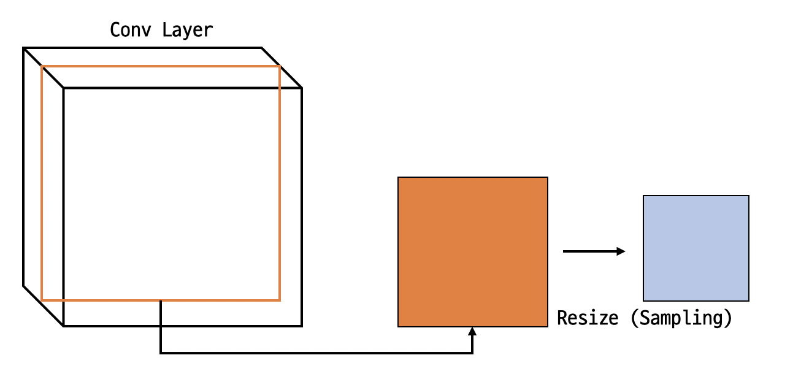
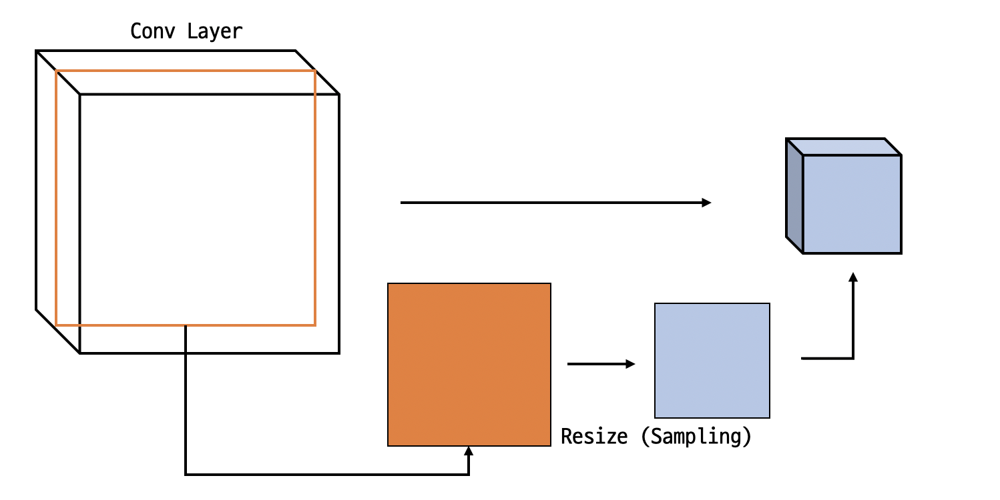
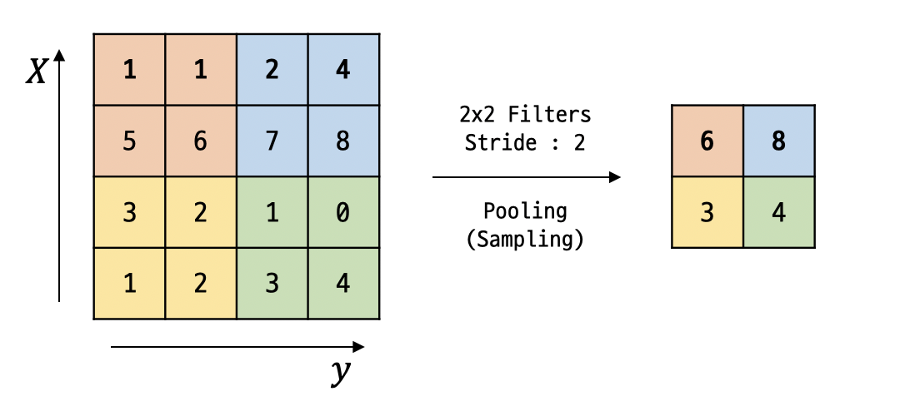

## ConvNet Max pooling 과 Full Network

### Pooling Layer (Sampling)
 
**Pooling**은 **Sampling**이라고도 한다. 
이미지에서 **Filter**를 처리한 후 생성된 **Conv Layer**에서 
**하나의 Layer**만 뽑아낸 후 **resize**(Sampling)를 한 **Layer**를 

 
위의 그림과 같이 여러겹으로 다시 **쌓는** 것을 **Pooling**이라고 한다. 

 

### MAX Pooling Example
 
**MAX Pooling**하나의 **Filter**에서 가장 큰 값을 
선택하여 값을 출력하는 **Pooling** 방법이다. 

$$4 \times 4$$ 크기의 Layer에서 $$2 \times 2$$ 크기의 **Filter**와 
**2**의 크기의 **Stride**를 적용해 **Pooling**을 진행하면 
$$2 \times 2$$크기의 Output이 나오게된다. 

 

### Fully Connected Layer (FC Layer)
마지막으로 **Pooling**한 값을 **Fully Connected Layer**에 
입력한 후 Softmax같은 **Classifier**에 넣어 결과를 출력한다. 
