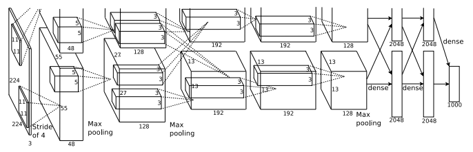

## ConvNet의 활용 예

### LeNet-5
**Lecun** et al (1998) 
손으로 쓴 $$32 \times 32$$의 글씨 이미지를 학습 
$$5 \times 5$$크기의 **Filter**로 **1**의 크기의 **Stride**사용 
**Pooling**을 진행할 때 $$2 \times 2$$크기와 **2**의 크기의 **Stride**사용 
 

 

### AlexNet
**Krizhevsky** et al (2012) 

 

입력값 : $$227 \times 227 \times 3 $$의 컬러 이미지 
첫번째 Layer : **CNN** (96개의 $$11 \times 11$$크기, Stride가 4인 Filter) 
출력값의 크기: $$55 \times 55 \times 96$$
첫 번쨰 Layer의 Parameter : $$(11 \times 11 \times 3) \times 96 = 35K$$ 
